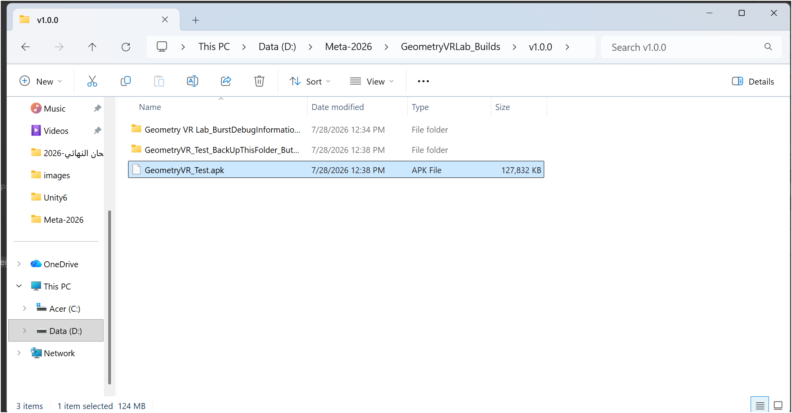
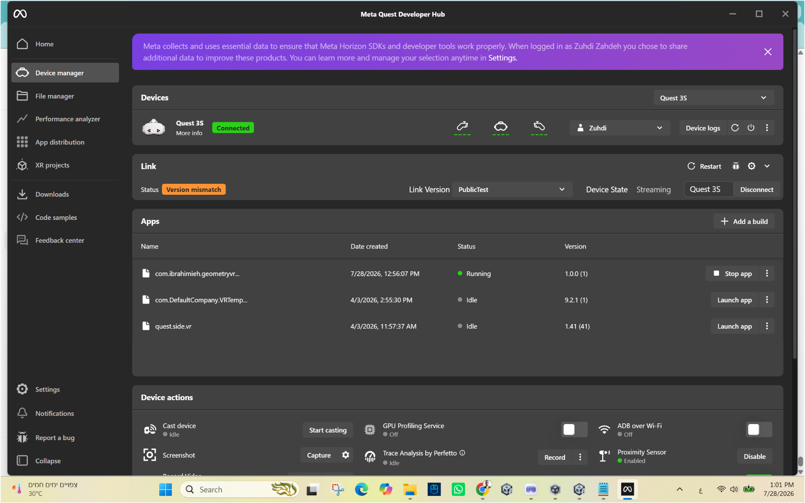
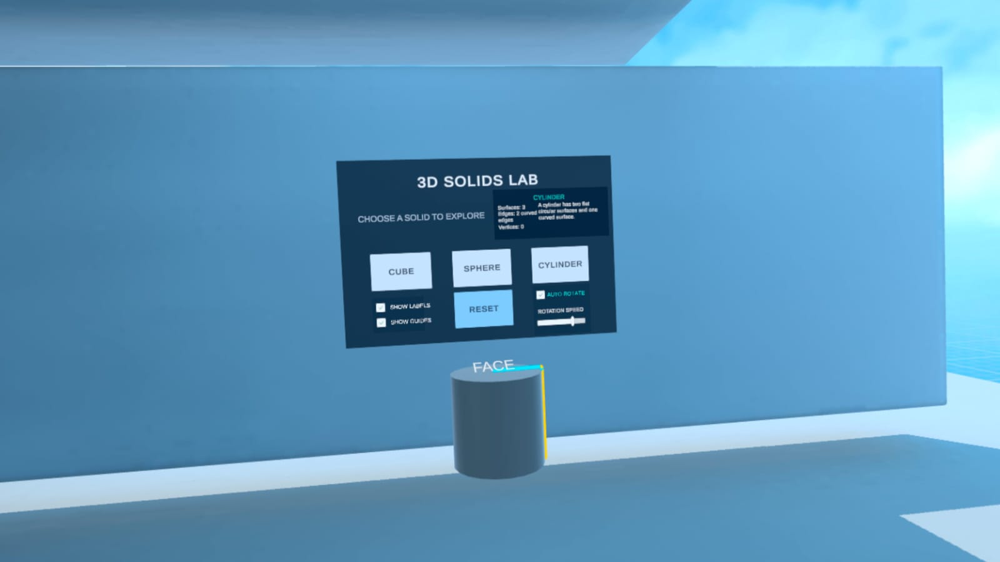
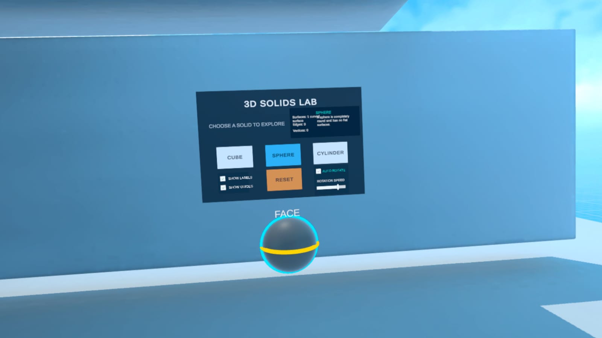
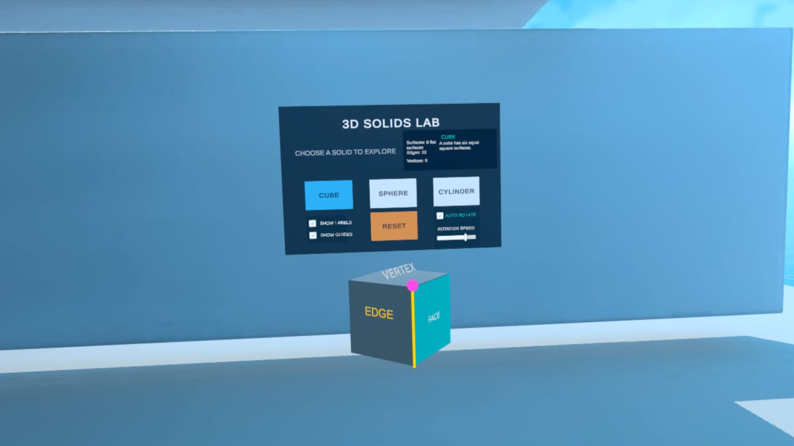
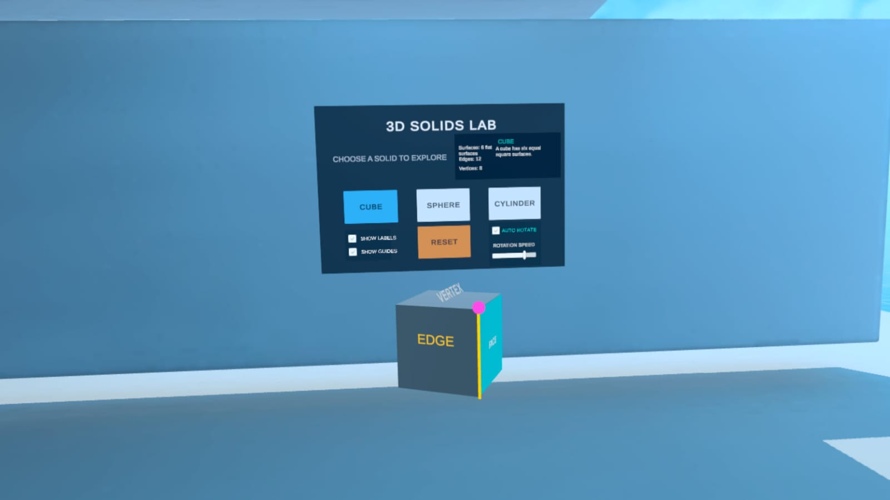
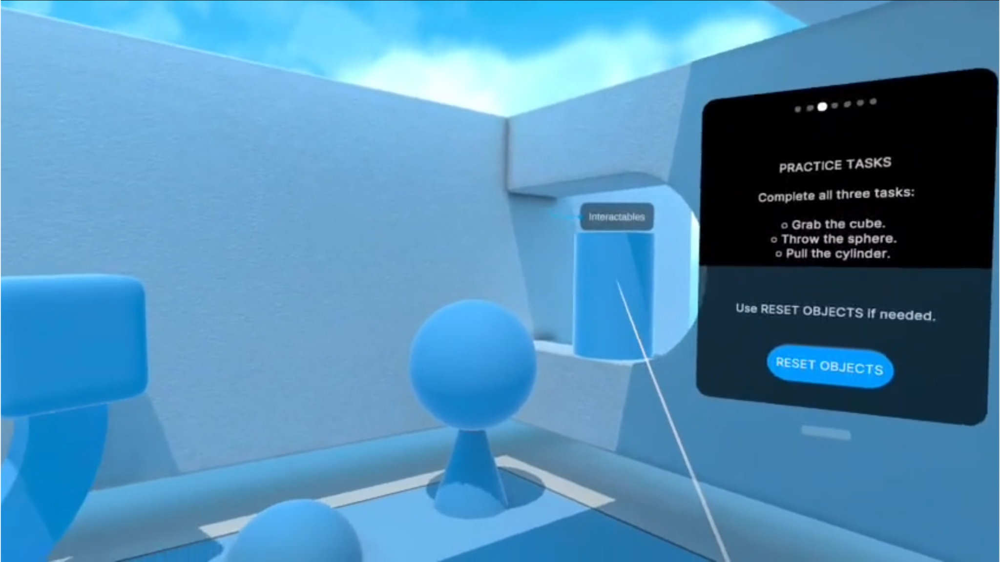
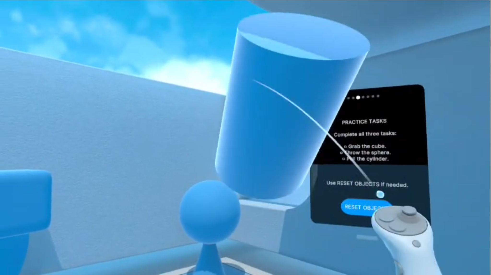
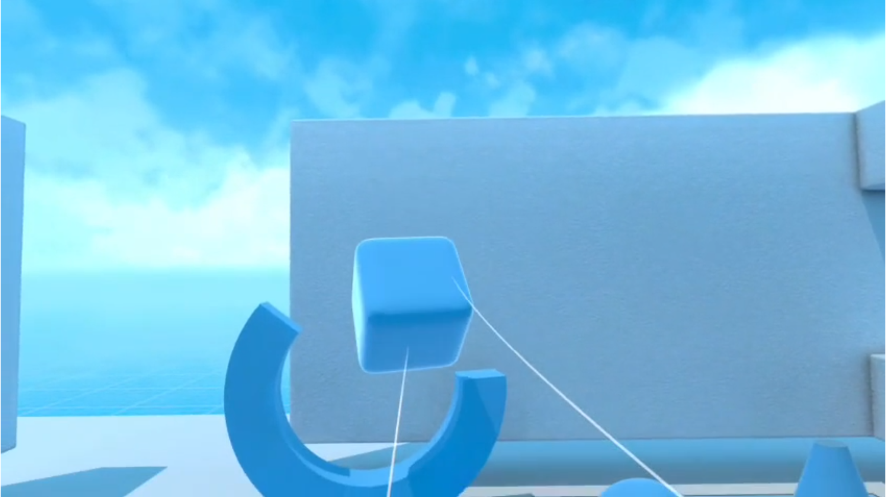

> هذه الصفحة تنقل نص الإصدار الأكاديمي المرفق، المؤرّخ في 29 تموز/يوليو 2026. تصف حالات الإنجاز والإتاحة كما وردت في تلك النسخة، ولا تُعد وصفًا تلقائيًا للإصدار الحالي. تُوثّق التطويرات اللاحقة في صفحة مستقلة.

<!-- source: P0406 -->
# الملحق (ط) {#top}

<!-- source: P0407 -->

<strong>التوثيق التطبيقي للإصدار المستقل</strong>

<!-- source: P0408 -->

<strong>Geometry VR Lab — Alpha v1.0.0</strong>

<!-- source: P0409 -->

يوثّق هذا الملحق الإنجاز العملي المتحقق بتاريخ 28 تموز/يوليو 2026، بعد تحويل المشروع من مشاهد تعمل داخل Unity إلى تطبيق Android مستقل وموقّع، ثم تثبيته وتشغيله واختباره فعليًا على نظارة Meta Quest 3S. ويُعد هذا الاختبار تحققًا وظيفيًا من سلامة البناء والتثبيت والتشغيل، ولا يُعد قياسًا لفاعلية التعلم لدى عينة من الطلبة.

<!-- source: P0410 -->
### طاقة تعريف التطبيق {#appendix-i-section-01}

<!-- source: T019 -->

<!-- table role: بيانات إصدار Alpha v1.0.0 -->
<table>
<tbody>
<tr><th>اسم التطبيق</th><th>Geometry VR Lab — مختبر الهندسة بالواقع الافتراضي</th></tr>
<tr><td>نوع المنتج</td><td>تطبيق واقع افتراضي تعليمي غامر وتفاعلي</td></tr>
<tr><td>الإصدار المختبَر</td><td>1.0.0 (Build 1) — Alpha</td></tr>
<tr><td>معرّف الحزمة</td><td>com.ibrahimieh.geometryvrlab</td></tr>
<tr><td>الجهاز المختبَر</td><td>Meta Quest 3S</td></tr>
<tr><td>بيئة التطوير</td><td>Unity 6.4 (6000.4.1f1)، OpenXR، XR Interaction Toolkit</td></tr>
<tr><td>حالة التشغيل</td><td>تم التثبيت والتشغيل المستقل بنجاح</td></tr>
<tr><td>حالة النشر</td><td>نسخة اختبار داخلية؛ لم يُنشأ رابط توزيع عام بعد</td></tr>
</tbody>
</table>

<!-- source: P0412 -->
### ما أُنجز في هذا الإصدار {#appendix-i-section-02}

<!-- source: P0413 -->

• إنشاء مفتاح توقيع دائم وربطه بالمشروع، ثم إنتاج ملف APK موقّع.

<!-- source: P0414 -->

• تثبيت النسخة عبر Meta Quest Developer Hub والتأكد من ظهور الإصدار 1.0.0.

<!-- source: P0415 -->

• تشغيل التطبيق داخل النظارة، ثم تشغيله من قسم Unknown Sources دون الاعتماد على Unity.

<!-- source: P0416 -->

• اختبار التهيئة، تتبع الرأس واليدين، الحركة والدوران، الإمساك والإفلات وإعادة المجسمات.

<!-- source: P0417 -->

• اختبار الانتقال إلى مختبر المجسمات واختيار المكعب والكرة والأسطوانة وإظهار الأدلة والتسميات والدوران الآلي.

<!-- source: P0418 -->

• إضافة ملفات الإرشاد الصوتي باللغة العربية وربطها بأحداث المشهد لتقديم التعليمات والتحفيز وإشارات الانتقال.

<!-- source: P0420 -->
### دليل البناء والتثبيت والتشغيل {#appendix-i-section-03}

<!-- source: P0421 -->

*شكل (ط-1): ملف APK الناتج عن عملية البناء في Unity، بحجم يقارب 124 MB.*

<!-- source: P0422 -->

شكل (ط-1): ملف APK الناتج عن عملية البناء في Unity، بحجم يقارب 124 MB.

<!-- source: P0423 -->

*شكل (ط-2): ظهور التطبيق بالإصدار 1.0.0 وحالة Running على نظارة Quest 3S داخل Meta Quest Developer Hub.*

<!-- source: P0424 -->

شكل (ط-2): ظهور التطبيق بالإصدار 1.0.0 وحالة Running على نظارة Quest 3S داخل Meta Quest Developer Hub.

<!-- source: P0425 -->

تثبت الصورتان اكتمال سلسلتي البناء والتوقيع من جهة، والتثبيت والتشغيل الفعلي على الجهاز المستهدف من جهة أخرى. أما رسالة Version mismatch الظاهرة في أداة المطور فتتعلق بخدمة Quest Link/Streaming، ولم تمنع تثبيت التطبيق أو تشغيل نسخة APK المستقلة.

<!-- source: P0427 -->
### متطلبات الاستخدام {#appendix-i-section-04}

<!-- source: P0428 -->
#### أولًا: ما يحتاجه الطالب {#appendix-i-section-05}

<!-- source: P0429 -->

• نظارة Meta Quest 3S أو جهاز Quest متوافق، مع وحدتي التحكم.

<!-- source: P0430 -->

• بطارية مشحونة ومساحة لعب آمنة ومحددة بحدود النظام، مع إبعاد العوائق.

<!-- source: P0431 -->

• تهيئة أولية قصيرة للتعرّف إلى النظر والحركة والدوران والإمساك والإفلات.

<!-- source: P0432 -->

• سماع واضح للتوجيهات العربية؛ مع ضبط مستوى الصوت بما يلائم الطالب والبيئة المدرسية.

<!-- source: P0433 -->

• إشراف المعلم، مع حق الطالب في إيقاف التجربة فور الشعور بالدوار أو الصداع أو فقدان التوازن.

<!-- source: P0434 -->
#### ثانيًا: ما يحتاجه المعلم أو المدرسة {#appendix-i-section-06}

<!-- source: P0435 -->

• نسخة التطبيق المثبّتة على النظارة؛ لا يحتاج التطبيق إلى حاسوب أثناء الاستخدام اليومي بعد التثبيت.

<!-- source: P0436 -->

• حاسوب Windows وكابل USB 3 وبرنامج Meta Quest Developer Hub عند تثبيت النسخة الداخلية أو تحديثها فقط.

<!-- source: P0437 -->

• حساب Meta مفعّل عليه وضع المطور عند استخدام التثبيت الداخلي.

<!-- source: P0438 -->

• شاشة خارجية أو البث من النظارة خيار مساعد لمتابعة الطالب، وليس شرطًا لعمل التطبيق.

<!-- source: P0439 -->

• إجراءات تنظيف مناسبة للنظارة ووسادة الوجه بين المستخدمين، وتنظيم جلسات قصيرة مع فواصل.

<!-- source: P0440 -->
### متطلبات تقنية مختصرة {#appendix-i-section-07}

<!-- source: T020 -->

<!-- table role: متطلبات تقنية للإصدار -->
<table>
<tbody>
<tr><th>نظام التشغيل المستهدف</th><th>Android/Meta Quest — تطبيق VR مستقل</th></tr>
<tr><td>الاتصال بالإنترنت</td><td>غير مطلوب لتشغيل الأنشطة المثبتة محليًا</td></tr>
<tr><td>الحاسوب أثناء الدرس</td><td>غير مطلوب بعد تثبيت التطبيق</td></tr>
<tr><td>طريقة التحكم</td><td>تتبع الرأس ووحدتا تحكم للحركة والإمساك والتفاعل</td></tr>
<tr><td>مساحة الاستخدام</td><td>مساحة آمنة وفق حدود النظارة؛ يمكن اعتماد الحركة الآنية لتقليل التنقل الجسدي</td></tr>
</tbody>
</table>

<!-- source: P0442 -->
### أداة التثبيت الداخلي للمعلم {#appendix-i-section-08}

<!-- source: P0443 -->

يمكن تنزيل Meta Quest Developer Hub من صفحة Meta الرسمية: <a href="https://developers.meta.com/horizon/downloads/package/oculus-developer-hub-win/" rel="noopener noreferrer">Meta Quest Developer Hub for Windows</a>

<!-- source: P0445 -->
### طريقة تثبيت التطبيق وتشغيله {#appendix-i-section-09}

<!-- source: P0446 -->
#### أ. التثبيت الأولي للنسخة الداخلية — ينفذه المعلم أو المسؤول التقني {#appendix-i-section-10}

<!-- source: P0447 -->

• 1. تشغيل نظارة Quest وتوصيلها بالحاسوب بكابل USB 3.

<!-- source: P0448 -->

• 2. الموافقة داخل النظارة على USB Debugging واختيار السماح الدائم لهذا الحاسوب عند ظهور الخيار.

<!-- source: P0449 -->

• 3. فتح Meta Quest Developer Hub ثم Device Manager والتحقق من ظهور الجهاز بحالة Connected.

<!-- source: P0450 -->

• 4. اختيار Add a build، ثم تحديد ملف GeometryVRLab_v1.0.0.apk وانتظار اكتمال التثبيت.

<!-- source: P0451 -->

• 5. تشغيل التطبيق مرة أولى والتحقق من التهيئة، ارتفاع الكاميرا، اليدين، المجسمات والأزرار.

<!-- source: P0452 -->
#### ب. تشغيل التطبيق من داخل النظارة {#appendix-i-section-11}

<!-- source: P0453 -->

• 1. الضغط على زر Meta في وحدة التحكم اليمنى لفتح القائمة الرئيسية.

<!-- source: P0454 -->

• 2. فتح شبكة Apps؛ وهي مكتبة التطبيقات في واجهة Quest الحديثة.

<!-- source: P0455 -->

• 3. فتح مرشح التطبيقات واختيار Unknown Sources لأن النسخة الحالية مثبّتة داخليًا.

<!-- source: P0456 -->

• 4. اختيار Geometry VR Lab أو معرّف الحزمة com.ibrahimieh.geometryvrlab.

<!-- source: P0457 -->

• 5. بدء التهيئة، ثم تنفيذ مهام التدريب قبل دخول مختبر المجسمات.

<!-- source: P0458 -->
#### ج. المسار التعليمي داخل التطبيق {#appendix-i-section-12}

<!-- source: T021 -->

<!-- table role: المسار التعليمي -->
<table>
<tbody>
<tr><th>1. التهيئة</th><th>التعرّف إلى النظارة ويدي التحكم والنظر والحركة داخل الغرفة الافتراضية.</th></tr>
<tr><td>2. التدريب الحر</td><td>حمل المجسمات وتحريكها وإفلاتها ورميها ثم إعادتها إلى أماكنها.</td></tr>
<tr><td>3. تأكيد النجاح</td><td>الانتقال من Intro إلى Tasks ثم Success بعد إتمام المهام.</td></tr>
<tr><td>4. مختبر المجسمات</td><td>اختيار Cube أو Sphere أو Cylinder واستكشاف الخصائص.</td></tr>
<tr><td>5. أدوات الفهم</td><td>إظهار Labels وGuides، استخدام Reset، وتشغيل Auto Rotate وضبط سرعته.</td></tr>
<tr><td>6. الإرشاد والمتابعة</td><td>الاستماع إلى التوجيهات العربية عند بدء المهمة وإنجازها والانتقال، مع بقاء المعلم متابعًا للفهم.</td></tr>
</tbody>
</table>

<!-- source: P0460 -->

دور المعلم هو توجيه الملاحظة وطرح الأسئلة وربط الخبرة الحسية بالمصطلح الهندسي، مع تجنب تقديم كل الإجابات قبل أن يدوّر الطالب المجسم ويراه من أكثر من جهة. ويساند الإرشاد الصوتي العربي هذا الدور بتقديم التعليمات الإجرائية والتشجيع وإشارات الانتقال، لكنه لا يستبدل الحوار التربوي أو متابعة الفهم.

<!-- source: P0462 -->
### صور من داخل التطبيق: الكرة والأسطوانة {#appendix-i-section-13}

<!-- source: T022 -->

<!-- table role: تخطيط صور الكرة والأسطوانة -->
<table>
<tbody>
<tr><td></td><td></td></tr>
<tr><td>شكل (ط-3): اختيار الأسطوانة وعرض معلوماتها.</td><td>شكل (ط-4): اختيار الكرة وإظهار دليل هندسي حولها.</td></tr>
</tbody>
</table>

<!-- source: T022 -->

*شكل (ط-3): اختيار الأسطوانة وعرض معلوماتها.*

<!-- source: T022 -->

*شكل (ط-4): اختيار الكرة وإظهار دليل هندسي حولها.*

<!-- source: P0464 -->

*شكل (ط-5): استكشاف المكعب وإظهار الوجه والحافة والرأس بألوان مختلفة.*

<!-- source: P0465 -->

شكل (ط-5): استكشاف المكعب وإظهار الوجه والحافة والرأس بألوان مختلفة.

<!-- source: P0466 -->

توضح اللقطات أن الطالب لا يشاهد صورة ثابتة؛ بل يختار المجسم ويغيّر زاوية رؤيته، ويُظهر الأدلة والتسميات المرتبطة بخصائصه. ويتيح ذلك الانتقال من الرسم ثنائي الأبعاد إلى خبرة مجسمة قابلة للملاحظة والتفاعل.

<!-- source: P0468 -->
### صور من داخل التطبيق: تدوير المكعب والتوثيق المرئي {#appendix-i-section-14}

<!-- source: P0469 -->

*شكل (ط-6): المكعب بعد تغيير زاوية الرؤية، مع استمرار ظهور التسميات المكانية.*

<!-- source: P0470 -->

شكل (ط-6): المكعب بعد تغيير زاوية الرؤية، مع استمرار ظهور التسميات المكانية.

<!-- source: P0471 -->
### الفيديو التوثيقي {#appendix-i-section-15}

<!-- source: P0472 -->

أُعدت نسخة مختصرة من التسجيل الأصلي بعد حذف المقاطع المهزوزة ولحظات اختفاء الكاميرا وظهور الغرفة الحقيقية. تبلغ مدة النسخة المختارة دقيقتين و43 ثانية، وتعرض التهيئة والتفاعل مع المجسمات والانتقال إلى مختبر المجسمات.

<!-- source: T023 -->

<!-- table role: بيانات الفيديو التاريخي -->
<table>
<tbody>
<tr><th>اسم ملف الفيديو</th><th>Geometry_VR_Lab_Best_Clips.mp4</th></tr>
<tr><td>مدة الفيديو</td><td>02:43</td></tr>
<tr><td>محتواه</td><td>التهيئة، الحركة، الإمساك، الانتقال، والمكعب والكرة والأسطوانة</td></tr>
<tr><td>طريقة إرفاقه</td><td>يُسلّم ملفًا رقميًا مرافقًا للبحث والعرض التقديمي</td></tr>
</tbody>
</table>

<!-- source: P0474 -->
### رابط التطبيق وحالة الإتاحة {#appendix-i-section-16}

<!-- source: P0475 -->

<strong>حتى تاريخ 28 تموز/يوليو 2026 لا يوجد رابط تنزيل عام للتطبيق؛ لأن ملف APK اختُبر داخليًا ولم يُرفع بعد إلى قناة Meta Alpha. لذلك تعتمد النسخة الحالية التثبيت عبر Meta Quest Developer Hub. عند رفع النسخة إلى Alpha يُضاف رابط الدعوة أو صفحة التوزيع هنا، مع رمز QR، من دون تغيير وصف النتائج التقنية الواردة في هذا الملحق.</strong>

<!-- source: P0476 -->

<strong>الصيغة المرجعية المقترحة بعد النشر: Geometry VR Lab — Alpha v1.0.0، إعداد وتطوير: زهدي زاهدة، 2026.</strong>

<!-- source: P0477 -->
### صور إضافية من مرحلة التهيئة والتدريب العملي {#appendix-i-section-17}

<!-- source: P0478 -->

*شكل (ط-7): لوحة مهام التدريب داخل غرفة التهيئة، وتظهر المجسمات وزر RESET OBJECTS قبل الانتقال إلى مختبر المجسمات.*

<!-- source: P0479 -->

شكل (ط-7): لوحة مهام التدريب داخل غرفة التهيئة، وتظهر المجسمات وزر RESET OBJECTS قبل الانتقال إلى مختبر المجسمات.

<!-- source: P0480 -->

*شكل (ط-8): تفاعل المستخدم مع الأسطوانة باستخدام وحدة التحكم، بما يوثّق عمل الإمساك والتحريك داخل التطبيق المستقل.*

<!-- source: P0481 -->

شكل (ط-8): تفاعل المستخدم مع الأسطوانة باستخدام وحدة التحكم، بما يوثّق عمل الإمساك والتحريك داخل التطبيق المستقل.

<!-- source: P0482 -->
### التفاعل الحر مع المجسمات في البيئة الافتراضية {#appendix-i-section-18}

<!-- source: P0483 -->

*شكل (ط-9): الإمساك بالمكعب وتغيير موضعه داخل غرفة التهيئة، مع ظهور شعاع التفاعل من وحدة التحكم.*

<!-- source: P0484 -->

شكل (ط-9): الإمساك بالمكعب وتغيير موضعه داخل غرفة التهيئة، مع ظهور شعاع التفاعل من وحدة التحكم.

<!-- source: P0485 -->

تدعم هذه اللقطات الغرض التربوي لمرحلة التهيئة؛ إذ يُمنح الطالب وقتًا قصيرًا للتعرّف إلى أدوات التحكم والتقاط المجسمات وتحريكها وإفلاتها قبل الدخول في المحتوى الهندسي المنظّم. وبذلك تُخفَّض الصعوبة التقنية الأولية، ويصبح الانتباه في المرحلة التالية موجّهًا إلى خصائص المجسمات والعلاقات المكانية بدل الانشغال بطريقة استخدام النظارة.
